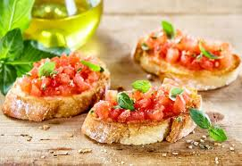

# Bruschetta Tradicional

Uma entrada clássica da culinária italiana que combina simplicidade e sabor autêntico.

## Ingredientes

- Pão italiano fresco
- Tomates cereja maduros
- Manjericão fresco
- Alho
- Azeite extra virgem
- Sal e pimenta
- Queijo parmesão (opcional)

## Preparo

Nossas bruschettas são preparadas com pão italiano fresquinho, grelhado até ficar crocante. Os tomates são cortados em cubos e temperados com alho, manjericão e azeite de qualidade. Uma explosão de sabores frescos!

## Destaques

- Pão artesanal italiano
- Tomates selecionados
- Manjericão fresco do nosso jardim
- Azeite extra virgem importado

---

*Perfeita para começar sua refeição!*
