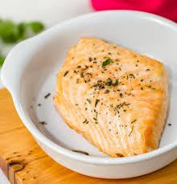

# Salmão Grelhado com Ervas

Um prato refinado que combina o sabor suave do salmão com um blend especial de ervas frescas.

## Ingredientes

- Salmão fresco (200g)
- Alecrim fresco
- Tomilho
- Limão siciliano
- Azeite extra virgem
- Sal e pimenta
- Vegetais da estação

## Preparo

O salmão é grelhado na perfeição, mantendo sua suculência natural, e temperado com nossas ervas especiais. Servido com vegetais frescos da estação, grelhados com azeite e limão.

## Destaques

- Peixe fresco diariamente
- Ervas colhidas do nosso jardim
- Preparo artesanal
- Acompanhamento vegetariano fresco

---

*Disponível no almoço e jantar. Peça já!*

